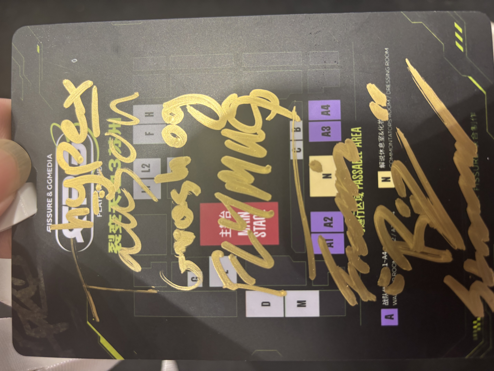
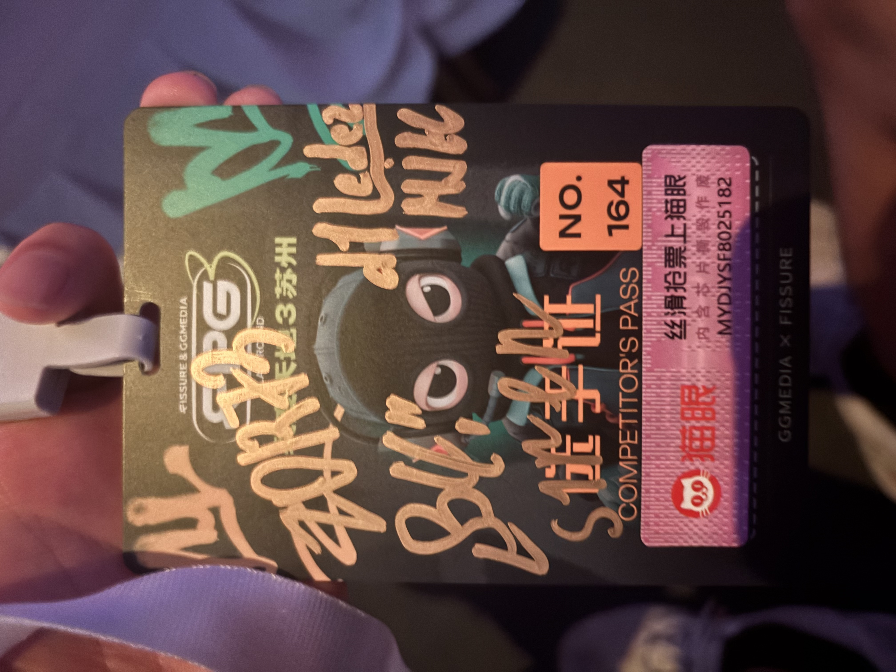
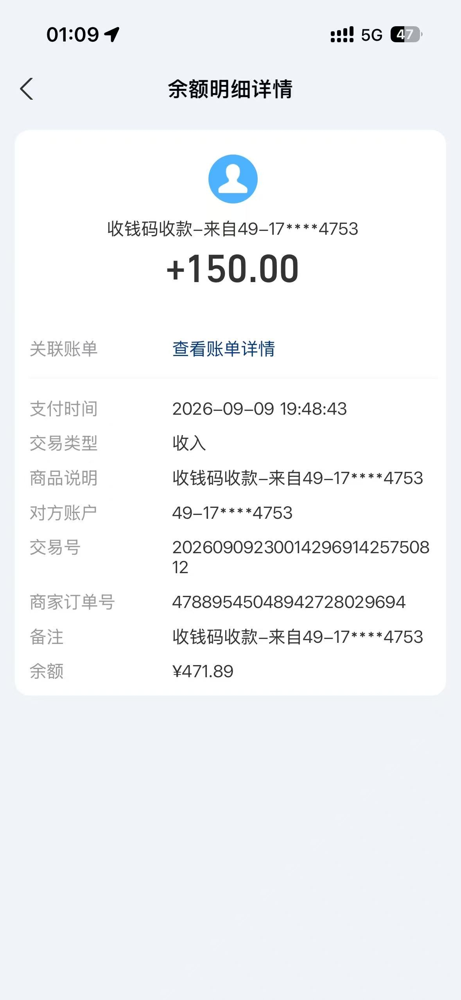
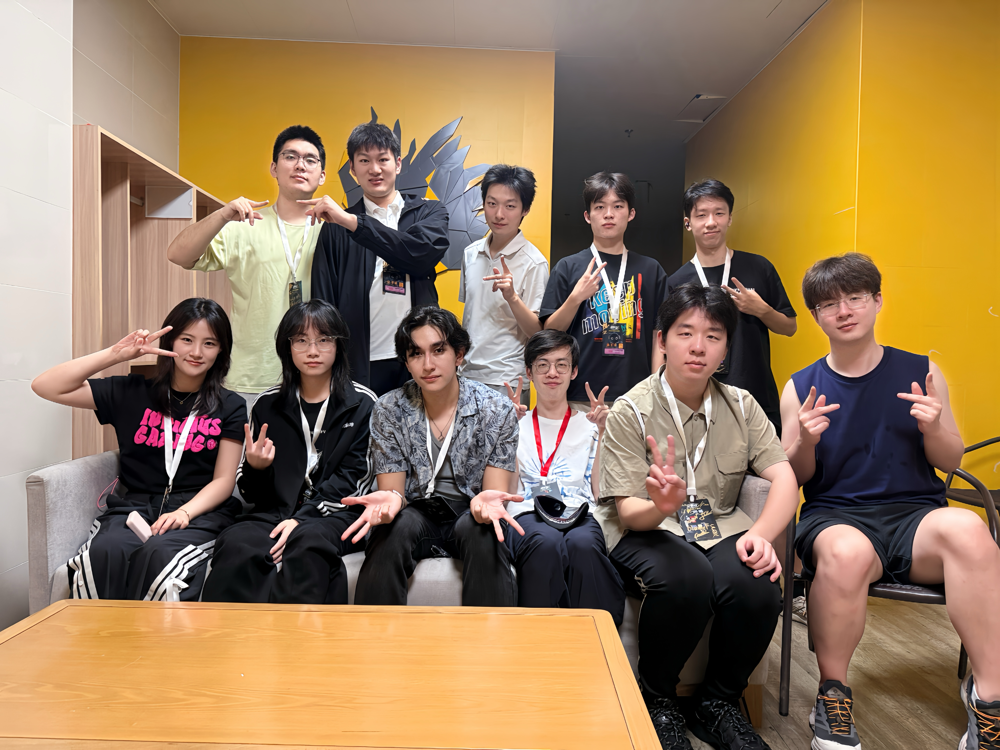

## 开端：志愿者的招募与培训
裂变天地3要在中国办的消息早有耳闻，只是一开始定的是深圳，后来却改成了苏州。苏州就苏州吧，我们学校离市区那么远，大抵我也是没那么想去看，毕竟我还是想存点钱看twice的七巡的。但是过两天比赛场馆公布，就在高新区文体中心，骑个车十几分钟就到了。都开到家门口了那我不得去看看啊？但是这个钱显然还是个问题。。

偶然的，学弟告诉我说njucs群里发布了一个招募志愿者的信息，我心想说，当个工作人员不就可以免费看比赛了吗？还能拿点补贴。于是我欣然报名，当时报名群里大概有32个人，主办方说是16个队1人跟一个，那么大概会选16个志愿者吧。在那时我还以为志愿者只是在场馆帮帮忙打打杂之类的，并没有多想。尽管后来其实**只招了8个志愿者**。

过了几天，举行了一次面试，问了很多跟选手有关的问题，比如选手想封烟我们怎么劝阻啊，选手想要几张票我们怎么说之类的。感觉还行吧，最后也是过了，然后通知说4号去搞个培训。

结果这个培训所在地点竟然是学校国会，培训也没说什么，主要是发现原来选手就住国会。培训之后我们每人拿了自己的队伍的logo就上楼给训练室贴上了。我带的队是BB和GL，感觉不算强也不算弱吧，反正当时对未来几天还是充满憧憬和好奇的。

## 开始：战队陆续抵达和比赛开幕
5号，我本以为我的俩队都还没来，但是其实BB已经到了一个经理了，他在训练室提出了一些问题，于是我也从工位赶了过去，然后跟经理聊了聊，加了个微信。其实我一直不知道我该如何称呼他，他的微信名字应该是他的本名，不如就叫Kirill吧。

后来BB的队员也来了，GL的队员也来了，我和GL的经理没碰上，后来加了她的discord，才知道她原来是Rez的女朋友。其实现在想来倒还好吧，我做的事真的算蛮少的，因为我觉得**让一些选管**去接机蛮不合理的，我觉得这很不公平。我做的一些事应该就是解决他们需要的一些物品，然后帮他们点外卖之类的。还有他们训练室的网不好啊，电脑不好啊，会让我联系技术人员来解决。从现在看我觉得其实还好，可能是我已经习惯了吧，不过至少在比赛还没开始的那两天，真的还算是忙得过来的。媒体日也是挺有意思的，ninjajam突然就塞过来一个在直播的手机，搞得我不知所措，也是蛮有趣的。

8号，比赛开始了。第一天我的两个队都在副场馆，其实就是篮球馆里面加了板子隔出来，然后有4个对战间。反正副场馆不用出场，整体上是很轻松的，但是这个时候其实一个人带俩队已经初现端倪了，因为主办方实际上在酒店没有人员留守，只能靠我们选管。有时候只有一两个选管在酒店，实在是有点忙。

## 困难与纠结：论文截稿临近和日程加多
可是到了9号啊，论文截稿临近了，我实在想多做些工作，可是那是GL也是我第一次去主舞台，实在是没办法，我其实只能希望天禄战胜GL，这样GL两败淘汰了我的时间就会多出来，可能就有更多时间写论文了。

结果真的！天禄击败了GL，然后我就跟GL回去了，尽管BB的副舞台还没打完，实在是有些对不住BB。于是GL淘汰了，我跟艾哥说，可能我要写论文，于是他说带GL去签名会吧。那么10号，我就早起准备写论文，然后下午跟GL去了签名会，获得了GL的签名和合影（嘻嘻。

```GL全队在我工作证上的签名```

可是带了签名会回来啊，我就马不停蹄的投入到写作和画图之中，最后我把电脑带回宿舍自习室做，终于在两点半做的是差不多了，发给师兄，实在熬不住了，睡觉去了。师兄是铁人啊，熬夜干了那么多图，实在是燃尽了。后来才发现BB三战全胜直接晋级半决赛了，于是11号虽然是20点截稿，但是因为没有比赛只有BB的签名会，所以我也是欣然规往。

```BB全队在我工作证上的签名```

12号是重头戏啊，是BB第一次到主场馆打比赛，而且还有入场的环节，总之最后是没出问题，我也找了个位置在内场看比赛。我希望G2赢啊！这样我决赛日就没有工作了哈哈，中立这一块。最后BB被让一追二了，看起来也很懊恼，赛后他们本来想坐shuttle去别的地方吃饭，但是我们说shuttle不能送他们去别的地方，于是他们就只能打车然后我们坐shuttle回去了。

13号，也就是今天，是 grand final 。这把是真的中立了，不过只打了三张图，看的不是很尽兴啊。玩大哥和csboy的表演赛也是很有意思的。这样一场决赛在现场看确实很激动，这倒也确实是难以复刻的体验。

## 在比赛背后：看见经验不足和准备不充分的本质
这是一次成功的赛事吗？或许是的。我在这几天感到开心吗？虽然累，但是是的。

但是我认为主办方缺乏专业性和准备。我之前当然没有听说过GGmedia，一个后来认识的工作人员告诉我说他们是BLAST的中文导播。说实在话，那不就是没办过这种大赛的吗。。

我始终认为很多这种事情不该由我们来做，但是在我观察很多时候就只有我们。拜托，我们只是普通的大学生而已，顶多就是对CS这个游戏有着一股热爱，我们并不专业，我们并不适合承担这种种责任。但是我们选管都是好人，我们坚持下来了，我们算是完成了这个任务。

但是我想说的是，作为一个大学生，我没有用过欧洲的app store账号，所以不知道在app store里面搜不到美团；我不喜欢喝咖啡，所以不知道瑞幸外卖员的电话只能通过下单的手机号联系；我只是一个大学生，所以或许没有那么多流动资金来给战队垫付。凡此种种，我相信是可以预见的情况，我相信是可以做好备案的情况，我相信是可以有更加专业的人或者培训来说明的情况。我们要给战队点外卖拿外卖，要陪战队去现场，要转达导演对于战队出场的指示，还要听从战队的各种或合理或离谱的要求。我认为，这足以是不专业的体现。

就像9月5日China GT上海站严重事故一样，多辆赛车发生碰撞，91号赛车遭到撞击后迅速起火，现场赛事方却反应迟钝，最后是依靠另一位参赛选手主动停车放弃比赛，才将受困的选手救出。网络上流传的一位大爷把灭火器丢在现场又立刻跑走了，有人说是大爷去找另外的灭火器了，而不是害怕火而逃跑。不知这是不是真相，但是不管是不是真相，当事故发生的时候，到达现场参与救援的只有拿着层层外包克扣后的低廉工资的大爷，而救护车里的救援人员还在车里睡觉的时候，我不禁想，这种大赛可能真的没有那么井井有条和准备充分。

公司和组织的本质是人，公司和组织做事情办活动的根本是人在做，而且特别的，不是领导在做。领导只是坐在指挥室里指手画脚而不是做实事的人，真正做实事的人并没有那么多。是受制于预算吗？这比赛赚的也不少吧，只能请的起几个100块一天的大学生吗。具体情况我不得而知，我只能从结果来推断了。这次我还是有得到新体会的，宏观上采取动作的是公司和组织，微观上其实是人，也许有时候我们离这些具体的动作差的也不远，这可能让我觉得有些解构或者让我觉得有些草台班子。

那天和GL的经理在休息室看他们在主场馆台上的比赛，我去跟她要前两天给他们买足球和红牛的钱。她说，这次的主办方有点unprepared。我说，是的。我只是一个普通的大学生，但是却被承担了在我看来如此重要的工作，并且得到的回报也是很少。我和她说，我每天只能拿到主办方给的100RMB。她很惊讶，因为在她的家乡德国，有法律规定的最低时薪。很遗憾，我没有告诉她，我们的工作是志愿者性质的。她问，你们每天工作多少小时？我说，只要你们需要。她很惊讶，她说，我要再扫一遍你的支付宝收款码。我不知道她要干什么，就给她扫了，现在想来，或许我该想到的。然后我看见她，在支付宝的支付页面给我转了150RMB。我马上阻止，我说，我每天有工资的，不需要这样做，我是为了热爱而做的。她说，没事的，这只是一个student给另一个student的帮助。

```GL经理joy赠```

那一刻我真的很感动，眼眶有点湿润。我觉得她很善良，很细心，我觉得她天生适合经理的这个角色。尽管在外她需要保持冷酷的态度来获得战队需要的信息和资源，她永远不会忘记她的善良的心，我觉得那一刻她闪耀着人性的光辉。

## 与战队的接触：两种截然不同却完美运行的战队模式
说到这里，我觉得我可以说说我这次接触的两队的不同的相处模式。

GL的经理是Rez的女朋友joy，我觉得她心思缜密，想的很周到，而且沟通上软硬兼施。有时候在Discord里面没有人理她，我会觉得她有点可怜，说实话。因为有些并不是我能处理的问题，但是我觉得她理应得到一些通知和回复。整体上来看，我认为GL更像是一个分工明确的小公司，所有比赛的事情交给选手和教练，比赛外的都交给joy。这当然是对的，并且是很有效率的。

BB的经理和领队和队员们都很熟悉，虽然我听不懂俄语，但是我经常听到他们开心的聊天。BB的经理也并不是神经大条，他的思考很多，很细心，并且我可以说，他很聪明。那几天我赶论文的时候，他们甚至是全自动处理的，自己吃饭、自己坐车出发、自己坐车回来，甚至有一天他们说他们要出去吃饭，就不用做shuttle了。我很少帮他们点外卖之类的，我觉得他确实是很聪明，BB可以说是事最少的一个战队了。并且这有点像兄弟CS的感觉，赢了就一起happy，输了就关起门来复盘，一起扛。

我并没有想说哪种运行方式更好，但是我确实深切的体会到了两种的差异。我觉得这两种运行方式都非常完美，我相信这也是他们能成为世界顶级战队的原因之一。

## 与同事的接触：如演唱会的“一次性朋友”般的交情，让我度过了愉快的几日
在这期间，我的同事有很多。

首先是艾哥，他是我们选管的老大。我的感觉就是，他很忙。虽然我觉得主办方或许不专业，但是我永远不会归因到艾哥头上，因为他上有老板，下面又有我们，什么事都要处理，确实是很忙。这些天真的辛苦了，艾哥。

然后是z姐和ww姐，虽然我接触不太多，但是我们都看kpop哈哈哈有时候在休息室里面一起唱两句也是蛮开心的。

当然不能忘了我的选管兄弟们。我们可以说是战友的交情了，对于我缺席的那两天，我真的感到很抱歉。每次看到你们处理战队很多事务很忙，我在心里面为你们打抱不平。我觉得我分到两个相对事少的队是幸运的，我应该承担为你们帮忙的责任的，但是我做的太少，我觉得很对不住你们。特别是对于接机和送机的兄弟们，你们真的辛苦了，记得要好好睡觉。

在场馆，认识了两个导演兄弟，我们在后台一起给战队指示如何出场，在后台一起吃饭一起看比赛，也是很开心。

还有一些裁判兄弟，你们也是被抓过来的哈哈哈，也算是好兄弟了

还有一位摄影师，那天在GL战队门口，我借了你的笔去要签名却没要到，最后跟GL一起回去了哈哈哈。还好第二天签名会你也来了，还好没成为遗憾。今天决赛也是偶然碰到了，一起看比赛，聊了两句，我突然好奇你看不看kpop，原来你是itzy粉丝哈哈哈然后我们直接聊到了Legacy夺冠，真的很开心。

当然，还有Ninjajam。Ninjajam真的是很善良的人，今天场间的时候偶然碰上，你拉着我和你一起逛，然后我们一起吃了饭，一起看了会比赛。B站一哥怎么这么没架子哈哈哈，也是美美的度过美好时光了好吧。

我曾经看过一个文案，说在演唱会的时候，旁边的人就是你在这个演唱会期间最好的“一次性朋友”。或许我们往后余生都不会再见了，或许在某年某月某日某地又再次遇见。但是至少这段时光，是一起度过的；这些挫折困难，是一起战胜的；这些快乐激动，是一起感受的。

## 结语
这是一次难忘的经历，这是一次绝无仅有的经历。在最后，我想以一个合照作为结尾，记录这一次FPG3之旅。
