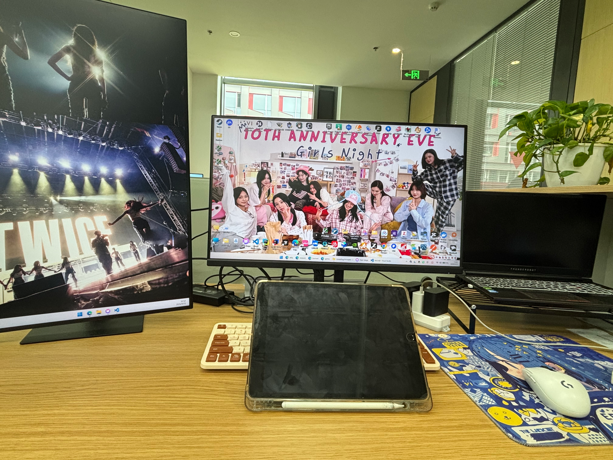
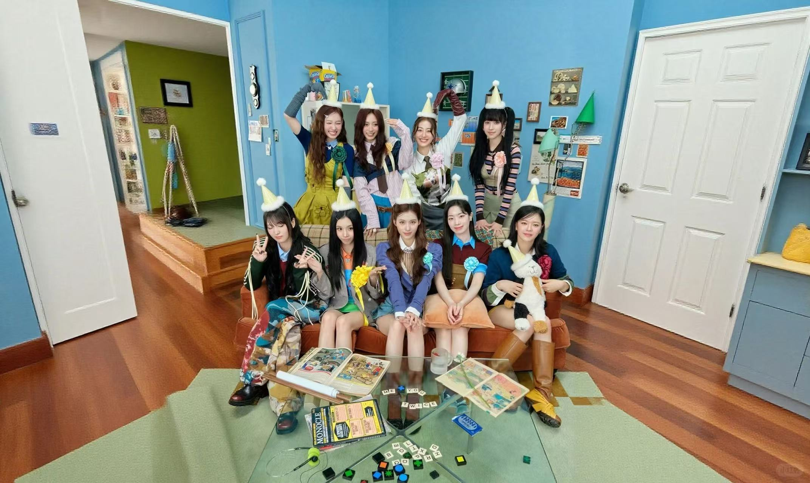

```有了两个显示屏的工位```
在工位有了两个显示屏之后，感觉我努力的动力也更强了，效率也能进一步提升了。于是我想到了近期的一些思考。这些思考虽然还不成熟，但是写下来有助于我整理自己的思绪，也有助于我之后回看的时候，体会自己的过去。

## AI时代，我该何去何从
前几天和老爸打电话的时候，他说，最近五年是AI的黄金时期，要我做好规划，趁着AI的浪潮赚钱。可是我想啊，我对未来的一些选择，能够规划/预测到那么远吗？五年之前，GPT还没有走进我们的生活；五个月之前，我还在苦恼没有科研做该怎么办；十几天之前，GPT-6Astra还没有发布。现在AI发展的这么快，我觉得真正预测是很难的，是需要勇气和运气的。

于是我说，我没办法预测的那么准确，但是我能确保我会选择当下我认为的最好的那个道路。也就是我也许找不到global maximum，毕竟我并不是预言家，我并没有上帝视角，但是我能够通过我的努力和智力来尽量让自己达到一个local maximum。

我觉得我的coding能力、我的学术能力和我的学习考试能力显然不是最强的，但是我的信息来源是很广泛的。也许我的能力不是很强，但是我的信息很多，于是这种信息可能能给我带来与别人不同的看法和观点，也带来了不同的机遇和选择。我很庆幸我是幸运的，我加入了房老师的课题组，能够实际的做一些科研的东西，并且有可以切身体会的进展。也许这个选择是转折性的，因为我有了除了软院和智软院以外的保研选择，有了更多的可尝试的机会，也认识了非常好的师兄师姐们。

我既已将这归结于运气，因为我幸运的听了cxy的没有留在之前的课题组，那么在这幸运之上，我当然要为之付出相应的努力。我的基础并没有那么牢固，并且许多知识一直半解，我应该借助于AI，不断提升自己的理解，提升自己的能力。

AI的出现确实毁坏了我的coding能力。我这两天学了vim，但是有些苦恼没有太多可以用的地方，毕竟我很少动手写代码了。不可以啊，作为软件工程专业的学生，我还是应该培养自己的代码能力的，所以从编译原理的lab开始，我应该尝试自己写代码。

当然这希望也落空了。毕竟自己写了半天没怎么写出来。让gpt和我一起改了很多版，最后终于满分了，我想，先把编译原理的语法分析看完，然后我们就重新写一下lab1吧。

## 关于未来，我想做些什么
这个问题可以说是贯穿我的大学这几年了。大一上是CS2(反恐精英)的时代，那个时候的我还不知道什么是绩点，什么是保研，只记得老爸说60就够了，最后几门课都有70，我心想，这是超额完成目标了。

到了大一下，我开始懂得了这一切，于是我想，我该选择哪个出路？我一向不是喜欢提前做计划做决定的人，但是我是喜欢提升自己的条件从而让自己客观上有更多选择的人。于是大一下我认真学习了，可惜最后被微积分摆了一道。

到了大二我更觉得紧迫了，如果保不上研那么出国显然是一个好选项。一年的学习甚至其实有大部分时间在实习，就能换来一个不错的研究生学历，这显然是高性价比的选择。于是我考了雅思，并且如果可以的话想大三去交换。我是一个容易在一个地方呆厌倦的人，所以对于没有生活过的国外，还是很向往的。并且我也确实报了纽大石溪分校的交换，虽然最后没选上就是了。

我很庆幸我没有把绩点落下，并且看前两天公示的大二学年的绩点排名，我对自己还是很满意的。毕竟在大一的时候，我肯定想不到能有这个排名。于是随着时间推移和我对港新授课硕的了解，现在我觉得，可能保研对我是最好的选项。一切选择都有好有坏，我的内心倾向也是不断在变化的，但是至少目前我认为保研是一条不赖的道路，因为我实际上已经到了能获得保研资格的境地了，那么确实可以考虑保研这个选择。

在学术的道路上我并没有什么特别喜欢的领域，毕竟我对很多领域的了解都不太深，基础也不太牢固，但是像传统软件和软件工程一类的我大致是不太感兴趣的。所以其实我不是很想保研到软院和智软，只能说希望能到别的地方读研吧。

那么读研之后又如何呢？从现在看我可能比较想进入工业界，毕竟工业界的资源和薪资都很丰富。但是未来的事谁知道呢，按照我的想法，显然是先把眼前的事做好。首先就是现在的科研，然后就是课内的东西，比如编译原理和机器学习。闲时学点知识做点项目，也可以打打游戏之类的放松一下。过几个月到保研季了，那是真的有的忙了。

我认为人也是一个状态机，各种外在和内在因素都可以看成是状态，而这些状态显然会影响人的选择（动作），人的选择又会反过来造成状态的改变。因此我在不同时期有不同的想法，我觉得是很合理的，因此我也不是很想去太早做一些未来的决定，因为你不可能以现在的状态去推断未来的状态从而为未来的你做出决定。同样的，我们没必要为已经发生的事后悔，因为就算有时光机回到过去，只要你的状态还没有改变，你还是会做出那个时候的选择（除非你带着现在的记忆回去）。

## 大学好像接近尾声了
是啊，还有10个月就预推免结束，那么大家都不知道去哪里发财了。可以说，我的大学生活可能就剩这几个月了吧。真的好快啊，往回看感觉每个学期发生的事都不太记得了，往前看又感觉很快就要到来了。

我的大学生涯是很丰富的，我认为我在知识上心理上精神上获得了莫大的成长。遗憾的是也许没有谈上一段美美的校园恋爱，遗憾的是我对人文方面的知识摄取大大减少了，尽管我现在有很大的兴趣。但是谁知道呢，既然还有那么几个月，那么就努力去过好，至少我的大学不会成为一段遗憾，而是一段美好的日子，一段我会回味一生的日子。

本来想写很多感谢的话的，想了想毕竟大学还没结束呢，就留给到时候再写吧。但是感谢TWICE的九位女孩，你们在我最黑暗的日子里给我带来力量，给我带来好运。未来的某个日子，我们一定会相见。这次还是唠唠叨叨的写太多了，也没有什么图片可以配，不如就配上一张TWICE的合照来作为结尾吧。
