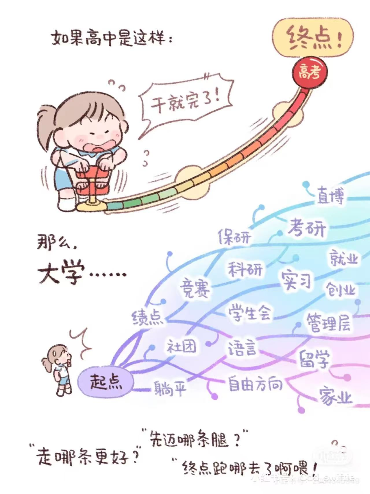
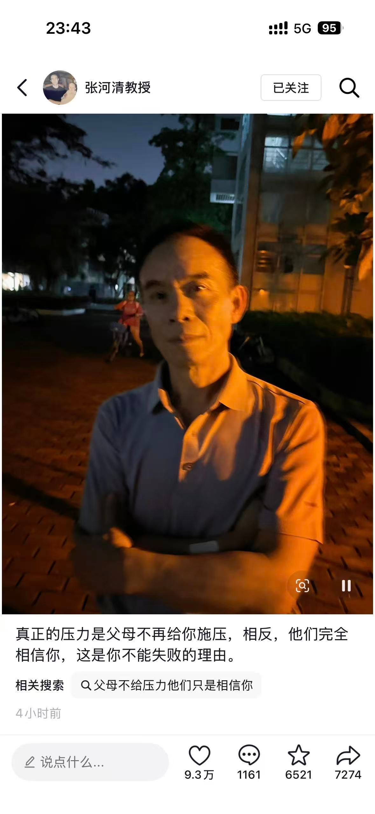

最近看到的一些文章，加上看到听到的一些事情，让我不禁想写一些文字下来，算是有些感触。

## [让本科生做回本科生](https://mp.weixin.qq.com/s/ePJdo3KHGKW2J_mCLobfbQ)
确实原文是在抖音刷到的，但是抖音的链接不太好放进文档，不如放一个微信公众号的文章。

作为现在进行时的本科生，看到这篇文章，第一反应就是很真实。当然这文章有一股很浓厚的AI味，但是他说的一些事情是很真实的，也是我切身体会的。老爸经常和我说的他那个年代的大学教育，和现在的显然已经截然不同，所以我庆幸我在大一下认识到了这一点，而不是更晚的时候。

人的时间和精力是有限的，但是理论上来说卷度可以是无上限的。这里的卷其实并不一定是贬义的，在内卷这个词出来以前这种事情是努力奋斗的体现，但是我不想用如此褒义的词来形容，所以用内卷这种中性词来说明。内卷已然成为很难抵挡的一种趋势，因为人总是想向上走，而在上面的人肯定也不甘心掉下来，于是便成了一种类似军备竞赛的情形。

是啊，本科生们太苦了，既要绩点，又要学工；既要论文，又要实习。短短的大学四年，大三就要决定去向，大二就要做好规划，大一就要开始疯狂的卷绩点、卷经历。好不容易摆脱了高考的苦海，却又面临着保研和绩点的压力。

作为本科生的一员，我也只能顺流而走，努力让自己成为更好的自己，努力让自己能够有更多的选择。我能做的，就是不把这些看成负担和麻烦，毕竟作为一个闲人，能够把原本丢在游戏上的时间用在这些我认为更有益处的地方对我来说也是很不错的。我向来不是喜欢闷头努力的人，也不算是一个能完全静下心来工作数个小时的人，所以现在这种丰富多彩的充实生活让我感觉十分满意。


```在xhs刷到的感觉好恰当的表达```

## [我们不要再聊AI绩点科研实习vibe-coding了](https://mp.weixin.qq.com/s/fq9ySGPJxmuCU9a8IJp-ww?scene=1&click_id=1163214690)
比起上一篇，这篇文章给我的感触更大。并且它也很短，也就是三段话而已。

也许给我最大的感受就是，我确实已经很长时间没有和别人有第一段话那样的聊天了，也不知道现在能找谁聊这些。感觉已经沉浸在ai之类的技术语境之中太久，倒是变得有点没生活了。

再过一会吧，等过这段应该就好了。而且我倒也不是没朋友聊天，只是那些好像无意义的聊天聊地很久没有了，让我有点想念。

我们去公园吧。在湖边走啊走一句话不说，看天慢慢变黑，某一瞬间环湖突然亮起一大片星星点点。昏黄的灯光掩住肃穆的城墙，我们在湖边坐下试图勾引鸭子游到我们脚下。风好轻柔，像水一样流动，我觉得自己像一条鱼在空中。

我好像回到了那个还没开智，只想在逃离高考苦海之后好好放松的大一，回到了玄武湖边，在湖边散步，漫无目的的聊天。

“不要，不要出卖你自己。我们装模作样一下就可以了。我无知地站在时代边上，留了很多灵魂给自己。”最后一段如是写道，只是这一段倒还没引起我太多共鸣。我并没有在出卖自己的灵魂做一些我不喜欢的事情，我每天也在做很多很多我喜欢的事情，并且从中获得了很多快乐。在这个焦虑和迷茫的时代，在这个焦虑和迷茫的年纪，比起别人，我算是不那么焦虑和迷茫的。我庆幸这一点，我也庆幸我并不在逼着自己做一些完全不感兴趣的东西。

## 神奇的大学生活
大学过的真快啊，虽然其实现在也只过了两年，按道理来说才只过了一半，但是感觉保研也就相当于毕业了，感觉我好像也快毕业了一样。

看我现在的生活，总结起来好像就是学习+游戏+焦虑。

如何学习？我不知道，AI时代到来，我好像很难静下心来去学一些东西。前几天看Diffusion Model和Flow Matching Model，在GPT的帮助下看了很多论文，实际上也没有细读，也更多的和他聊天而获得了一些知识。可是如果由于幻觉他说的东西有错怎么办？可是如果有他遗漏的重要知识怎么办？我不知道，我好像不会学习了，我不知道应该如何学习了。

还是应该静下心来去看一些知识，做一些项目吗？希望我能静下心来吧，不要总是被游戏和视频掳走我的注意力了。

在游戏中逃避？没有游戏我就无从释放压力，但是现在这几天显然有点陷入游戏了。在工位还是好好做些事情吧，等做完一些事情之后再打游戏也没啥负罪感了。

如何应对焦虑？这一点我倒是蛮好的，特别是现在有了一些可以作为抓手的东西，也就有时候深夜会感觉有点焦虑罢了。焦虑可能已经成为大家的通病，也许我的方法就是向游戏里面去逃避，这样至少玩游戏的时候我不焦虑。从小到大我就不是一个爱卷的人，学不进的时候我从不逼着自己学，因为那样我真的学不进。游戏和足球，以及现在的kpop，无疑是我的能量站和避风港。我坚信磨刀不误砍柴工，所以我在玩的时候以及玩之后都不太会有负罪感（当然有时候也只是我希望如此）。

希望大家也能找到自己的应对焦虑的方法。

```虽然图文无关但是蛮有感触的```

## 谈婚论嫁？
听我妈说大我两岁的小舅舅好像在打算结婚了，这确实让我有些吃惊。

马上读研了，可能又是单身三年吧。

其实我倒是不急，只是有时候看到别人谈的幸福的样子会羡慕罢了，还有更多的也许是对未经历过的事的好奇吧。人生就是要体验，而我这么大了还没体验过谈恋爱是什么，让我觉得有些可惜。这青春好像已经逝去了，不知还有没有可能呢。

结婚那么远的事，还是先别想比较好吧。